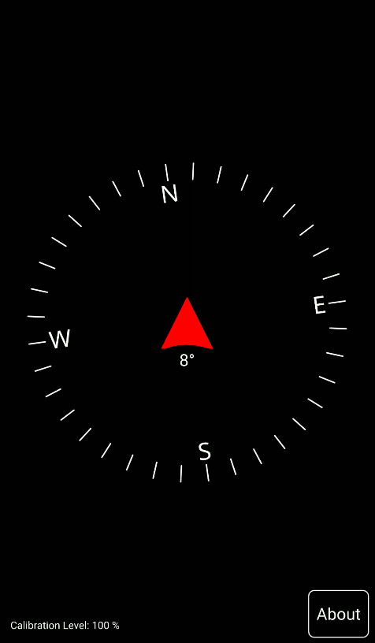

# Qompass
This is exactly what you need: a simple compass app.


### Demo



## Downloading

Go to Github Releases page and download the latest APK file.

This app is not (yet) available at F-Droid.

## Building

(This building guide lacks some details)

Make sure to have Qt 6 for Android with Qt Sensors and Qt SVG installed in your machine.

You'll also need Android SDK, NDK and Java JDK. My current NDK version is `25.1.8937393`.

If you install Qt 6 with its online installer, the android files will be at ~/Qt/${QT_VERSION}/android_${ANDROID_ABI}

The CMake command will be:

```bash

cd Qompass

cmake -S . \
	-B build \
	-DANDROID_ABI="arm64-v8a"\
	-DANDROID_NDK=$HOME/Android/Sdk/ndk/25.1.8937393 \
	-DANDROID_SDK_ROOT=$HOME/Android/Sdk \
	-DANDROID_PLATFORM="android-31" \
	-DCMAKE_GENERATOR="Ninja" \
	-DCMAKE_BUILD_TYPE="Debug" \
	-DCMAKE_TOOLCHAIN_FILE:FILEPATH=$HOME/Android/Sdk/ndk/25.1.8937393/build/cmake/android.toolchain.cmake \
	-DCMAKE_PREFIX_PATH=$HOME/Qt/6.5.2/android_arm64_v8a \
	-DCMAKE_FIND_ROOT_PATH:PATH=$HOME/Qt/6.5.2/android_arm64_v8a \
    -DQOMPASS_VERSION="1.1.0" \
\

```

The `QOMPASS_VERSION` variable is optional, and defined by this project only at CMakeLists.txt.

Then:

```bash

cd build

ninja

```
